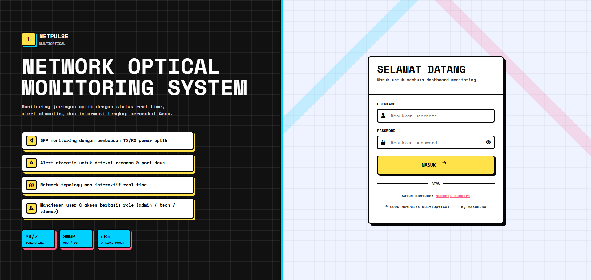

# NetPulse MultiOptical

NetPulse MultiOptical adalah platform monitoring jaringan optik/SFP untuk workflow NOC/ISP. Project ini berisi Laravel web dashboard, legacy web API, REST API v1 untuk Flutter mobile app, polling SNMP, alert log, Telegram alert, FCM push notification, dan interactive network map.

Dokumentasi lengkap ada di:

- [docs/NETPULSE_DOCUMENTATION.md](docs/NETPULSE_DOCUMENTATION.md)

## Tampilan Login



## Fitur Utama

- Dashboard KPI device/interface/SFP/alert/user.
- Monitoring optical RX/TX/loss dengan chart history.
- Device management dan interface discovery via SNMP.
- Support optical polling untuk MikroTik dan Huawei.
- Network map dengan node, link, status link, path editing, dan detail interface.
- Alert log Web UI, Telegram alert, dan FCM push notification.
- Role-based access: `admin`, `technician`, `viewer`.
- Flutter Android app versi `2.0.0+2`.

## Stack

- Laravel 11, PHP 8.2+
- Blade, vanilla JavaScript, Chart.js, Leaflet
- MySQL/MariaDB
- PHP SNMP extension
- Flutter Android app
- Firebase Cloud Messaging HTTP v1

## Struktur Singkat

| Path | Fungsi |
| --- | --- |
| `app/Http/Controllers` | Controller web dan legacy web API. |
| `app/Http/Controllers/Api/V1` | REST API v1 untuk mobile. |
| `app/Services/InterfaceDiscovery.php` | SNMP discovery, polling, alert. |
| `app/Console/Commands/PollInterfaces.php` | Command `poll:interfaces`. |
| `routes/web.php` | Web page dan legacy `/api/*`. |
| `routes/api.php` | Mobile `/api/v1/*`. |
| `resources/views` | Blade UI. |
| `public/assets` | CSS/JS web UI. |
| `mobile/` | Flutter Android app. |
| `scripts/cron/laravel_schedule_run.sh` | Cron wrapper Laravel scheduler. |

## Backend Quick Start

```bash
composer install
cp .env.example .env
php artisan key:generate
php artisan migrate
php artisan serve
```

Contoh `.env` MySQL:

```env
APP_NAME="NetPulse MultiOptical"
APP_URL=http://localhost

DB_CONNECTION=mysql
DB_HOST=127.0.0.1
DB_PORT=3306
DB_DATABASE=netpulse
DB_USERNAME=netpulse
DB_PASSWORD=secret

SESSION_DRIVER=database
QUEUE_CONNECTION=database
CACHE_STORE=database
```

Catatan instalasi database:

- Aplikasi ini dapat berjalan di atas database monitoring existing.
- Tabel inti yang dibutuhkan: `users`, `snmp_devices`, `interfaces`, `interface_stats`, `settings`.
- Migration repo membuat tabel pendukung seperti session/cache/job, alert log, API token, device token, dan lokasi user.
- Detail schema dan deployment ada di [docs/NETPULSE_DOCUMENTATION.md](docs/NETPULSE_DOCUMENTATION.md#database).

## Web UI

Halaman utama:

- `/login`
- `/dashboard`
- `/monitoring`
- `/devices`
- `/map`
- `/users`
- `/settings`

Legacy API untuk web UI berada di `/api/*`, misalnya:

- `GET /api/devices`
- `GET /api/interfaces?device_id=1`
- `GET /api/interface_chart?device_id=1&if_index=2&range=1h`
- `GET|POST /api/settings`
- `GET /api/alert_logs`

## Mobile API v1

Base path:

```text
/api/v1
```

Endpoint utama:

- `POST /api/v1/auth/login`
- `POST /api/v1/auth/logout`
- `GET /api/v1/dashboard`
- `GET /api/v1/monitoring/devices`
- `GET /api/v1/monitoring/interfaces`
- `GET /api/v1/monitoring/chart`
- `GET /api/v1/map/nodes`
- `GET /api/v1/map/links`
- `GET /api/v1/alert-logs`
- `POST /api/v1/device-token`
- `POST /api/v1/location`
- `GET|POST /api/v1/alert-preferences`

Authenticated endpoint memakai header:

```http
Authorization: Bearer <token>
```

## Scheduler dan Polling

Laravel scheduler menjalankan polling setiap menit:

```php
Schedule::command('poll:interfaces')->everyMinute()->withoutOverlapping();
```

Command manual:

```bash
php artisan poll:interfaces
php artisan poll:interfaces --device=1
php artisan schedule:list
```

Cron production:

```cron
* * * * * /var/www/NetpulseMultiOptical/scripts/cron/laravel_schedule_run.sh
```

Log scheduler:

```text
storage/logs/schedule-run.log
```

## Settings Penting

Settings disimpan di tabel `settings`:

- Telegram: `bot_token`, `chat_id`
- Alert channel: `alert_telegram_enabled`, `alert_webui_enabled`
- Alert event: `alert_interface_down`, `alert_interface_up`, `alert_interface_warning`, `alert_device_down`, `alert_device_up`
- RX threshold: `alert_rx_warning_high`, `alert_rx_warning_low`, `alert_rx_down_threshold`
- Theme: `theme`, `primary_color`, `primary_soft`
- Mobile push preference: `mobile_alert_pref_user_<id>`

Untuk FCM backend, set env:

```env
FIREBASE_SERVICE_ACCOUNT_JSON=/path/to/firebase-service-account.json
```

## Mobile App

```bash
cd mobile
flutter pub get
flutter build apk --debug
```

Output:

```text
mobile/build/app/outputs/flutter-apk/app-debug.apk
```

Firebase Android file lokal:

```text
mobile/android/app/google-services.json
```

File secret Firebase tidak boleh di-commit.

## Verifikasi

```bash
php artisan route:list
php artisan schedule:list
php artisan test
```

## License

MIT
