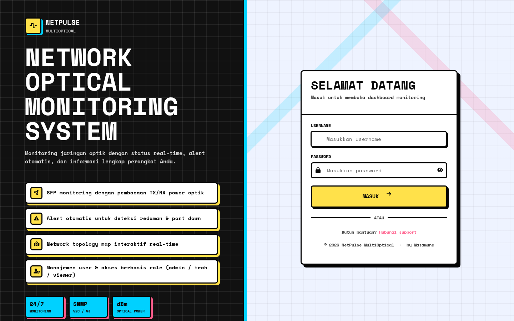

<div align="center">

# NetPulse MultiOptical

**Fiber-optic network monitoring for ISP and NOC teams.**
SFP optical power (DDM), interface status, SLA reporting, an interactive network map,
and instant alerts — on the web and on Android.




</div>

---

## Why NetPulse

Fiber links rarely fail all at once. Optical power drifts for days before a port goes dark.
NetPulse polls your switches and routers over SNMP every minute, records the RX/TX power of
every SFP, and tells you **before** a degrading link turns into an outage — while also giving
you the uptime numbers you need for SLA reports.

## Features

| | |
|---|---|
| **Optical monitoring** | RX/TX power, loss and temperature per SFP, with history charts from 1 hour up to 1 year. |
| **Interface status** | Up/down state of every interface, traffic history, and per-interface thresholds. |
| **Degradation detection** | A daily job flags links whose optical power is trending down, before they fail. |
| **SLA reports** | Availability per device and interface for any period, exportable to CSV and PDF. |
| **Network map** | Leaflet map of nodes and links, with live link status, editable paths and a lock mode. |
| **Alerts** | Web UI alert log, Telegram notifications and Firebase push to the mobile app, with maintenance-window mutes per device (or globally). |
| **Discovery** | SNMP interface discovery, including the Huawei optical module MIBs (ENTITY-MIB + HUAWEI-ENTITY-EXTENT-MIB); MikroTik is supported too. |
| **Roles** | `admin`, `technician` and `viewer`. Viewers only ever see demo data. |
| **Android app** | Flutter app for dashboards, monitoring, the map and push alerts. |

## Tech stack

- **Backend:** Laravel 12 (PHP 8.2+), MariaDB or MySQL, PHP SNMP extension
- **Web UI:** Blade, vanilla JavaScript, Chart.js, Leaflet
- **Mobile:** Flutter (Android), Firebase Cloud Messaging HTTP v1
- **PDF export:** barryvdh/laravel-dompdf

## Getting started

### Requirements

- PHP 8.2 or newer with the `snmp`, `pdo_mysql`, `mbstring` and `xml` extensions
- Composer 2, Node.js (only if you rebuild front-end assets)
- MariaDB 10.6+ or MySQL 8
- SNMP v2c read access to the devices you want to monitor

### Install

```bash
git clone <this-repository-url> netpulse
cd netpulse
composer install
cp .env.example .env
php artisan key:generate
php artisan migrate
php artisan serve
```

Point `.env` at your database:

```env
APP_NAME="NetPulse MultiOptical"
APP_URL=https://netpulse.example.com

DB_CONNECTION=mysql
DB_HOST=127.0.0.1
DB_PORT=3306
DB_DATABASE=netpulse
DB_USERNAME=netpulse
DB_PASSWORD=change-me
```

> NetPulse can run on top of an existing monitoring database. The core tables it expects are
> `users`, `snmp_devices`, `interfaces`, `interface_stats` and `settings`; the migrations in this
> repository add the supporting tables (sessions, cache, jobs, alert logs, API tokens, device
> tokens, rollups). See [docs/NETPULSE_DOCUMENTATION.md](docs/NETPULSE_DOCUMENTATION.md#database).

### Scheduler

All polling runs through the Laravel scheduler. Add one cron entry:

```cron
* * * * * cd /path/to/netpulse && php artisan schedule:run >> /dev/null 2>&1
```

| Command | Schedule | Purpose |
|---|---|---|
| `poll:interfaces` | every minute | SNMP poll of all devices, stats and alerts |
| `stats:rollup` | hourly | Aggregate raw samples into hourly rollups |
| `stats:prune` | daily 03:30 | Delete raw samples past their retention |
| `optical:degradation` | daily 06:00 | Detect links with declining optical power |

Run a poll by hand with `php artisan poll:interfaces` (or `--device=<id>` for one device).

### Push notifications (optional)

Point the backend at a Firebase service account and keep the file outside the web root:

```env
FIREBASE_SERVICE_ACCOUNT_JSON=/secure/path/firebase-service-account.json
```

Telegram alerts are configured from **Settings** in the web UI (bot token and chat ID are
encrypted at rest).

## Mobile app

```bash
cd mobile
flutter pub get
flutter build apk --debug
```

For release builds, provide your own signing key through `mobile/android/key.properties`
or the `NETPULSE_KEY_PROPERTIES` environment variable — the release build refuses to fall back
to the debug key. Add your own `mobile/android/app/google-services.json` for push notifications.
Neither file belongs in version control.

## API

The Android app talks to a token-authenticated REST API under `/api/v1`
(`Authorization: Bearer <token>`; tokens are stored hashed and expire after 90 days).

| Method | Endpoint | Description |
|---|---|---|
| `POST` | `/api/v1/auth/login` · `/auth/logout` | Obtain or revoke a token |
| `GET` | `/api/v1/dashboard` | KPI summary |
| `GET` | `/api/v1/monitoring/devices` · `/interfaces` · `/chart` | Optical monitoring data |
| `GET` | `/api/v1/interfaces` · `/interfaces/traffic-history` | Interface list and traffic |
| `GET` | `/api/v1/map/nodes` · `/map/links` | Network map |
| `GET` `DELETE` | `/api/v1/alert-logs` | Alert history |
| `GET` `POST` | `/api/v1/alert-preferences` · `/settings` | Per-user preferences |
| `POST` | `/api/v1/device-token` · `/location` · `/push/test` | Push registration and test |

The web UI uses a separate session-authenticated API under `/api/*`.
Full reference: [docs/NETPULSE_DOCUMENTATION.md](docs/NETPULSE_DOCUMENTATION.md).

## Testing

```bash
composer test        # or: bash scripts/test.sh
```

Always use the wrapper. It forces an in-memory SQLite database and refuses to run if the
connection resolves to anything else, so a cached production config can never point the
test suite at a live database.

## Security

- Login is rate-limited per user and per IP; error messages do not reveal whether a user exists.
- SNMP communities and bot tokens are encrypted at rest and never returned by the API.
- Changing a user's password, role or status revokes all of their API tokens.
- Everything rendered from device data (names, interface aliases) is HTML-escaped.

Found a vulnerability? Please report it privately through
[GitHub Security Advisories](../../security/advisories/new) instead of opening a public issue.

## Project layout

| Path | Contents |
|---|---|
| `app/Http/Controllers` | Web pages and the session-based web API |
| `app/Http/Controllers/Api/V1` | Mobile REST API |
| `app/Services/InterfaceDiscovery.php` | SNMP discovery, polling and alerting |
| `app/Console/Commands` | Scheduled commands (polling, rollups, pruning, degradation) |
| `resources/views`, `public/assets` | Blade templates, CSS and JavaScript |
| `mobile/` | Flutter Android app |
| `docs/` | Full documentation and the Huawei optical OID map |

## License

[Creative Commons Attribution-NonCommercial 4.0 International](LICENSE) (CC BY-NC 4.0).
Free to use, study and adapt for non-commercial purposes with attribution. For commercial use,
please get in touch first.

Built by Masamune for PT Berkah Media Kusuma Vision.
